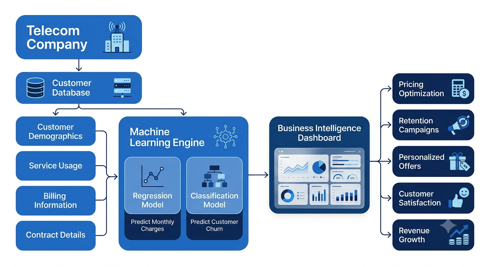
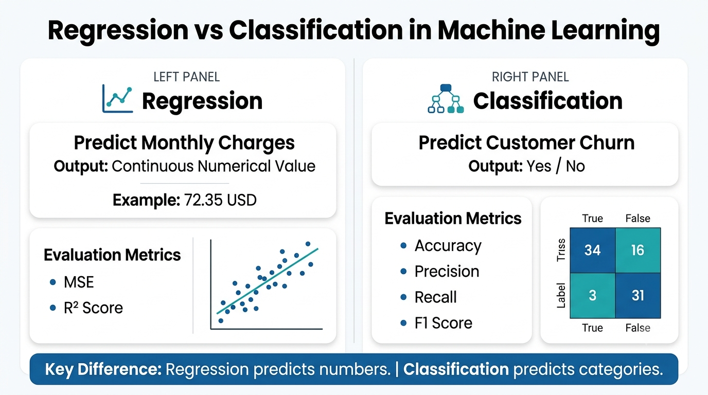

<p align="center">
  
</p>

# Telco Customer Churn Pricing & Retention Analysis

> **End-to-End Machine Learning Project | Regression & Classification | Business Analytics**

### Project Overview

Customer retention is one of the biggest challenges in the telecommunications industry. Losing existing customers increases acquisition costs and directly impacts revenue. At the same time, understanding the factors influencing monthly pricing helps companies optimize their pricing strategies.

This project develops two machine learning models using the **IBM Telco Customer Churn Dataset**:

- **Regression Model** to predict customer **Monthly Charges**
- **Classification Model** to predict whether a customer is likely to **Churn**

The project follows a complete end-to-end machine learning workflow, beginning with business understanding and ending with business recommendations.

---

###  Business Problem

The telecom company wants to answer two important business questions:

1. **How much should a customer be charged each month based on their subscribed services?**
2. **Which customers are likely to leave the company so retention strategies can be applied before churn occurs?**

By solving these problems, the company can improve pricing decisions and reduce customer attrition.

---

### Project Objectives

- Predict customer monthly charges using regression.
- Predict customer churn using classification.
- Identify the most influential factors affecting pricing and churn.
- Translate analytical findings into actionable business recommendations.

---

###  Dataset

**Dataset:** IBM Telco Customer Churn Dataset

The dataset contains customer demographic information, subscribed services, billing details, contract information, and churn status.

##### Dataset Summary

- **Rows:** 7,043
- **Columns:** 21

##### Key Variables

- Gender
- Senior Citizen
- Partner
- Dependents
- Tenure
- Phone Service
- Internet Service
- Online Security
- Online Backup
- Device Protection
- Tech Support
- Streaming TV
- Streaming Movies
- Contract
- Paperless Billing
- Payment Method
- Monthly Charges
- Total Charges
- Churn

---

### Project Workflow

<p align="center">

</p>

The project follows a structured machine learning pipeline consisting of:

- Business Understanding
- Problem Formulation
- Dataset Understanding
- Data Quality Assessment
- Data Cleaning
- Exploratory Data Analysis
- Feature Relationship Analysis
- Data Leakage Investigation
- Feature Engineering
- Data Preprocessing
- Regression Modeling
- Classification Modeling
- Model Interpretation
- Business Recommendations
- Project Conclusion

---

### Business Solution Pipeline

<p align="center">

</p>

The pipeline illustrates how customer data is transformed into predictive insights that support pricing optimization and customer retention.

---

###  Machine Learning Tasks

<p align="center">

</p>

##### Regression Task

**Target Variable**

- MonthlyCharges

**Models Evaluated**

- Linear Regression
- Decision Tree Regressor
- Random Forest Regressor

---

##### Classification Task

**Target Variable**

- Churn

**Models Evaluated**

- Logistic Regression
- Decision Tree Classifier
- Random Forest Classifier

---

### Exploratory Data Analysis Highlights

Key findings from the analysis include:

- Customers with month-to-month contracts exhibited the highest churn rates.
- Customers with shorter tenure were more likely to leave the company.
- Fiber optic users experienced higher churn than DSL customers.
- Customers with higher monthly charges showed a greater tendency to churn.
- Most customers were non-senior citizens.
- Several service-related features significantly influenced customer pricing.

---

###  Model Performance

#### Regression Models

| Model | MSE | R² Score |
|--------|------:|------:|
| Linear Regression | **1.0794** | **0.9988** |
| Random Forest Regressor | 1.6152 | 0.9982 |
| Decision Tree Regressor | 2.5658 | 0.9971 |

---

#### Classification Models

| Model | Accuracy | Precision | Recall | F1 Score |
|--------|---------:|----------:|-------:|---------:|
| Logistic Regression | **0.8038** | **0.6476** | **0.5749** | **0.6091** |
| Random Forest Classifier | 0.7896 | 0.6258 | 0.5187 | 0.5673 |
| Decision Tree Classifier | 0.7186 | 0.4701 | 0.4626 | 0.4663 |

---

###  Key Insights

- Internet service type is the strongest driver of monthly charges.
- Customer tenure is the strongest predictor of churn.
- Month-to-month contracts are associated with the highest churn.
- Higher monthly charges are linked with increased churn.
- Long-term contracts improve customer retention.

---

### Business Recommendations

- Improve onboarding for new customers.
- Encourage customers to adopt long-term contracts.
- Review pricing strategies for high-bill customers.
- Enhance the experience of fiber optic customers.
- Use churn prediction to trigger proactive retention campaigns.
- Personalize retention offers based on customer behavior.

---

###  Technologies Used

- Python
- Pandas
- NumPy
- Matplotlib
- Seaborn
- Scikit-learn
- Google Colab
- Git & GitHub

---

###  Repository Structure

```text
Telco-Customer-Churn-Pricing-Retention-Analysis
│
├── README.md
├── LICENSE
├── requirements.txt
│
├── notebook/
│   └── Telco_Customer_Churn_Pricing_Retention_Analysis.ipynb
│
├── images/
│   ├── project_banner.png
│   ├── ml_project_workflow.png
│   ├── business_solution_pipeline.png
│   └── regression_vs_classification.png
│
└── dataset/
    └── Telco-Customer-Churn.csv
```

---

### Future Improvements

- Hyperparameter tuning
- Ensemble boosting algorithms (XGBoost, LightGBM, CatBoost)
- Address class imbalance using SMOTE
- Model deployment with Streamlit or FastAPI
- Real-time prediction pipeline

---

###  Author

**Saira Ashraf**

BS Computer Science  

Aspiring AI Software Engineer | Machine Learning Enthusiast | Data Science Learner

---

 If you found this project interesting, consider giving the repository a star!
